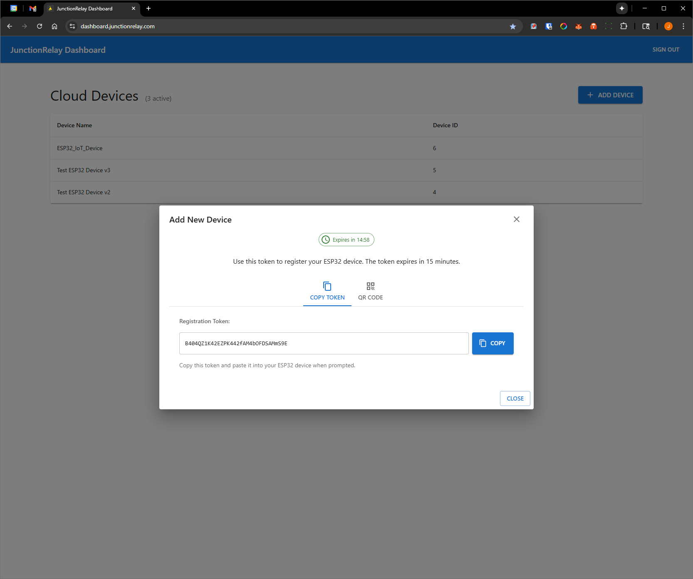
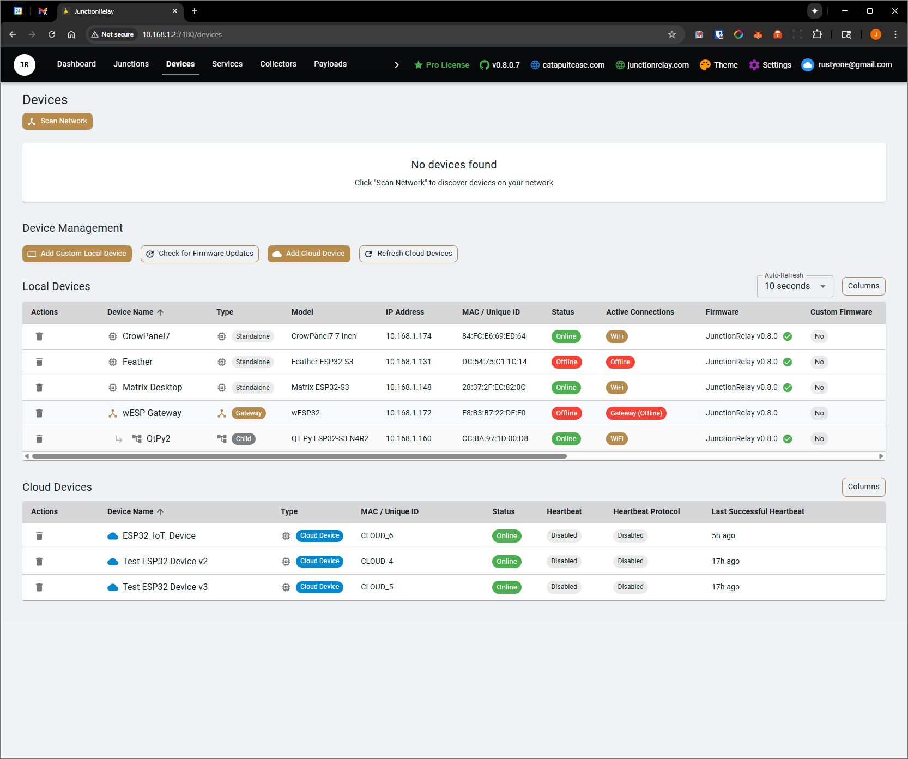
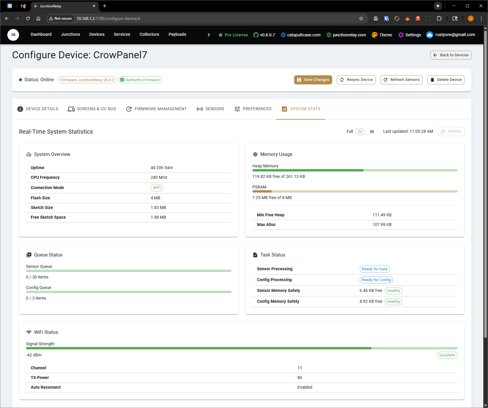
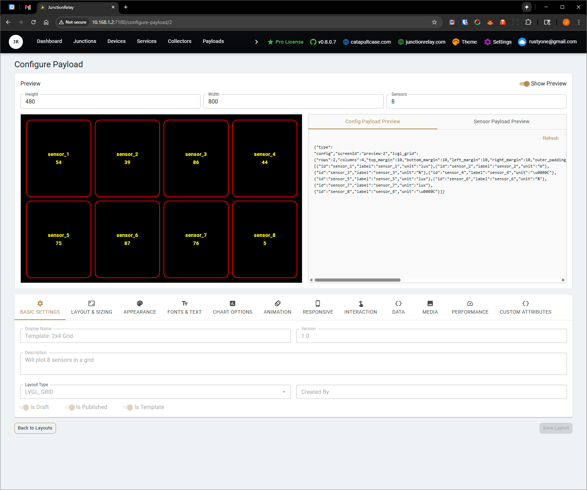
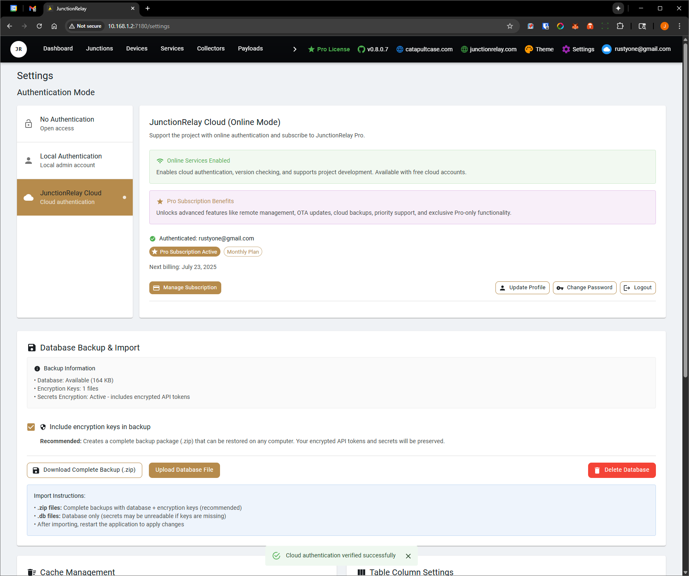

# JunctionRelay

**JunctionRelay** is an open-source modular platform for real-time device and sensor coordination. Built for rapid deployment via Docker, it features a robust `.NET 8` backend and a modern React frontend for managing dynamic layouts, sensor data flows, and device orchestration across smart infrastructure.

🔗 [Visit junctionrelay.com](https://junctionrelay.com)  
☁️ [Cloud Dashboard](https://dashboard.junctionrelay.com)

---

## 🚦 Overview

JunctionRelay serves as a central hub for connected hardware—sensors, microcontrollers, and display screens. It manages real-time data collection, collation, routing, and visualization with minimal setup. Primarily designed to communicate with ESP32 devices embedded into CatapultCase designs, the system has evolved into a flexible backend-frontend stack deployable on everything from Raspberry Pi clusters to industrial-grade servers, now with **cloud integration** for simplified device management.

Most importantly, **JunctionRelay connects seamlessly with existing services** like:

- 🏠 **Home Assistant**
- 🖥️ **LibreHardwareMonitor**
- 📡 **MQTT Brokers**
- 📈 **Uptime Kuma**
- 💻 **Native Host Machine Sensors**
- ☁️ **Cloud-managed ESP32 Devices**

This allows you to **consolidate data** from your smart home, PC hardware, servers, monitoring dashboards, and cloud-managed IoT devices into a single orchestrated control interface.

---

## 🧩 Key Features

- 📦 **Containerized Deployment** — Launch instantly using Docker or compile for Windows
- 🌐 **Modern React Web UI** — Intuitive browser-based control and configuration
- ⚙️ **Modular .NET 8 Backend** — RESTful API support and robust data handling
- ☁️ **Cloud Device Management** — Manage ESP32 devices through secure cloud registration
- 🔄 **Multi-Protocol Output** — Supports LVGL, MQTT, and custom formats
- 🖥️ **Visual Screen Editor** — Build LVGL-based UI layouts directly from the web
- 🔌 **Device Discovery** — Scan the network for compatible hardware and manage them remotely
- 🚀 **OTA Firmware Flashing** — Push official JunctionRelay firmware to supported devices wirelessly
- 🔋 **Small Footprint** — Optimized for low-power hardware like ESP32-S3

---

## 📡 Built-in Data Collectors

JunctionRelay includes out-of-the-box collectors for:

- 🖥️ **Host Device** — Collect data from the system running JunctionRelay
- 🏠 **Home Assistant** — Pull real-time sensor values from your smart home setup
- 📟 **LibreHardwareMonitor** — Monitor PC internals (CPU temps, fan speeds, voltages, etc.)
- 📈 **Uptime Kuma** — Ingest service and uptime metrics from your existing Uptime Kuma instance
- 📡 **MQTT Broker** — Ingest data from any MQTT-compatible sensor or service
- ☁️ **Cloud Devices** — Monitor and collect data from cloud-registered ESP32 devices

💬 Want more integrations? [Request additional collectors in Discussions »](https://github.com/catapultcase/JunctionRelay/discussions)

---

## 🔐 Authentication Options

JunctionRelay offers three flexible authentication modes to match your security needs and deployment environment:

| Mode | Security | Online Required | Best For |
|------|----------|-----------------|----------|
| **No Authentication** | Open Access | ❌ Offline | Development, trusted networks |
| **Local Authentication** | Username/Password | ❌ Offline | Multi-user, basic protection |
| **Cloud Authentication** | OAuth + Pro Features | ✅ Online | Production, advanced features |

### 🌐 **No Authentication (Offline Mode)**
Perfect for development and trusted environments. Zero setup, complete privacy, no external dependencies.

### 🏠 **Local Authentication (Offline Mode)**  
Secure local admin account with offline operation. Create username/password protection while keeping all data local.

### ☁️ **Cloud Authentication (Online Mode)**
Enterprise-grade security with cloud integration. You can register all your devices for free, however only 1 device can be 'Active' at a time on a free license. Consider a Pro subscription to support ongoing development and access for remote management, OTA updates, cloud backups, and priority support as they become available.

**💳 Pro Subscription Benefits:**
- Remote device management and monitoring
- Over-the-air ESP32 firmware updates  
- Automatic configuration backups
- Priority support and exclusive features
- Monthly or Annual subscription plans available

Configure authentication mode in Settings → User Management to match your deployment needs.

---

## ☁️ Cloud Device Integration

JunctionRelay now supports **cloud-managed ESP32 devices** for simplified deployment and management. This allows you to register ESP32 devices through a secure cloud service and have them automatically appear in your local JunctionRelay instance.

### 🎯 **Cloud Device Benefits**

- **Zero Configuration** — No network discovery or manual device setup required
- **Secure Registration** — Token-based device registration with user approval workflow
- **Automatic Management** — Devices appear automatically in your JunctionRelay instance
- **Remote Monitoring** — Monitor device health and status through the cloud dashboard
- **Seamless Integration** — Cloud devices work alongside local devices in the same interface

### 📱 **Using the ESP32 Sample Code**

The `Arduino_Examples/Device_Registration/` folder contains sample ESP32 code that demonstrates cloud device registration:

#### 🚀 **Quick Start**

1. **Hardware Setup**
   ```cpp
   // Update WiFi credentials in the sample code
   const char *ssid = "YOUR_WIFI_SSID";  
   const char *password = "YOUR_WIFI_PASSWORD";
   ```

2. **Upload Sample Code**
   - Install the **ArduinoJson** library via Arduino IDE Library Manager
   - Upload the sample code to your ESP32 device

3. **Device Registration**
   - Open the [Cloud Dashboard](https://dashboard.junctionrelay.com)
   - Click **"Add Device"** and generate a registration token
   - Enter the token into your ESP32 serial monitor when prompted
   - Approve the device in the cloud dashboard

4. **Automatic Integration**
   - The device will automatically appear in your local JunctionRelay instance
   - Health data and sensor readings are available immediately
   - No additional configuration required

#### 🛠️ **Interactive Testing**

The sample code includes a debug interface accessible via serial monitor:

| Command | Description |
|---------|-------------|
| `help` | Show all available commands |
| `status` | Display device information and connection status |
| `health` | Send health report immediately |
| `expire` | Force token expiry to test refresh flow |
| `refresh` | Test token refresh manually |

#### 🔒 **Security Features**

- **JWT Authentication** — Secure device-to-cloud communication
- **Automatic Token Refresh** — Seamless token renewal without user intervention
- **User Approval Workflow** — Manual confirmation required before device activation
- **Secure Storage** — Tokens stored in ESP32 non-volatile memory

---

## 🔌 ESP Device Protocols

JunctionRelay supports a wide range of communication protocols to interact with ESP32-based devices. This gives you flexibility depending on your hardware setup and reliability requirements:

| Protocol                   | Description                                                                 |
|----------------------------|-----------------------------------------------------------------------------|
| ☁️ **Cloud Integration**   | **NEW** - Secure cloud-managed devices with automatic registration and health monitoring. |
| 🌐 **Ethernet**           | Reliable and low-latency. Ideal for stationary or high-performance setups using devices like the WESP32. |
| 📶 **Wi-Fi**              | Most common option. Easy to configure and works well for mobile or wireless sensor nodes. |
| 🔌 **COM / Serial**       | Direct USB or UART connection. Useful for debugging or permanent wired installations. |
| 🔄 **WebSockets**         | Full-duplex, low-latency communication with the backend. Perfect for real-time data and UI updates. |
| 🌐 **HTTP**               | Lightweight and easy to integrate. Devices can push or pull updates from RESTful endpoints. |
| 📡 **MQTT**               | Publish/subscribe protocol for loosely coupled sensor networks. Compatible with external brokers. |

You can configure the protocol per device depending on its capabilities and purpose. Many devices support fallback modes (e.g. Wi-Fi → Ethernet), and all communication methods can coexist within the same JunctionRelay instance.

---

## 🚀 Quick Start with Docker Hub

You can now run JunctionRelay instantly using the prebuilt image hosted on Docker Hub:

```bash
docker run -d \
  --name junctionrelay \
  -p 7180:7180 \
  catapultcase/junctionrelay:latest
```

This pulls the latest version of JunctionRelay and exposes the web interface at [http://localhost:7180](http://localhost:7180).

🔗 **Docker Hub:** [catapultcase/junctionrelay](https://hub.docker.com/repository/docker/catapultcase/junctionrelay)

> Tip: Add `--restart unless-stopped` to run it automatically after reboot.

---

## 🛠️ Build from Source (Optional)

Prefer to build it yourself? You can compile and run the backend and frontend locally:

### 🧱 1. Clone the repository

```bash
git clone https://github.com/catapultcase/JunctionRelay.git
cd JunctionRelay\JunctionRelay_Server
```

### 🌐 2. Install frontend dependencies

The React-based Web UI is located in `junctionrelaywebui`. Before running the backend, install the required frontend dependencies:

```bash
cd junctionrelaywebui
npm install
npm run build
cd ..
```

> 💡 This generates the production-ready frontend in `junctionrelaywebui/build`.

### 📁 3. Copy frontend build to backend `wwwroot/static`

The backend expects static assets to be present in `JunctionRelay_Server/wwwroot/static`, but this folder is excluded from Git (`.gitignore`).

You **must manually copy** the frontend build output into the backend's static directory:

#### On Windows:
```bash
xcopy /E /I /Y junctionrelaywebui\build JunctionRelay_Server\wwwroot\static
```

#### On macOS/Linux:
```bash
cp -r junctionrelaywebui/build/* JunctionRelay_Server/wwwroot/static/
```

> ⚠️ If you skip this step, the web interface will not load correctly when running the backend.

### ⚙️ 4. Run the server

```bash
dotnet run
```

Once running, navigate to [http://localhost:7180](http://localhost:7180) to access the web interface.

---

## 📋 Example Projects

### 🌡️ **Smart Sensor Network**
Deploy multiple ESP32 devices with temperature, humidity, and motion sensors. Use cloud registration for easy setup and monitor all devices from a central JunctionRelay dashboard.

### 🏠 **Smart Home Integration**
Combine Home Assistant data with cloud-managed ESP32 displays throughout your home. Create custom dashboards showing weather, security status, and energy usage.

### 🖥️ **PC Monitoring Station**
Build an ESP32-based external display showing real-time PC performance metrics from LibreHardwareMonitor, combined with custom sensor data.

### 📊 **Industrial Monitoring**
Deploy JunctionRelay on a Raspberry Pi to collect data from multiple ESP32 sensor nodes across a facility, with centralized logging and alerting.

---

## 📸 Screenshots

#### Cloud Device Management
*New cloud dashboard for managing ESP32 devices with secure registration and health monitoring.*

#### Plotters


#### UI Thumbnails

| Dashboard | Cloud Dashboard | Devices |
|---|---|---|
|  |  |  |

| Stats | Payloads | Settings |
|---|---|---|
|  |  |  |


---

## 🤝 Contributing

We welcome contributions! Whether you're fixing bugs, adding features, or improving documentation, your help makes JunctionRelay better for everyone.

- 🐛 **Bug Reports** — [Open an issue](https://github.com/catapultcase/JunctionRelay/issues)
- 💡 **Feature Requests** — [Start a discussion](https://github.com/catapultcase/JunctionRelay/discussions)
- 📖 **Documentation** — Help improve our guides and examples
- 🔌 **Device Integrations** — Add support for new hardware or protocols

---

## 📄 License

JunctionRelay is open-source software licensed under the [MIT License](LICENSE).

---

## 🔗 Links

- 🌐 **Website:** [junctionrelay.com](https://junctionrelay.com)
- ☁️ **Cloud Dashboard:** [dashboard.junctionrelay.com](https://dashboard.junctionrelay.com)
- 📦 **Docker Hub:** [catapultcase/junctionrelay](https://hub.docker.com/repository/docker/catapultcase/junctionrelay)
- 💬 **Discussions:** [GitHub Discussions](https://github.com/catapultcase/JunctionRelay/discussions)
- 🐛 **Issues:** [GitHub Issues](https://github.com/catapultcase/JunctionRelay/issues)