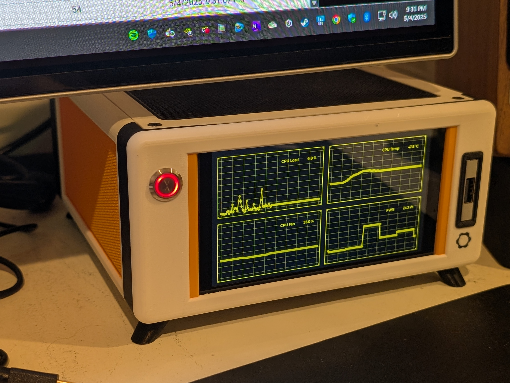
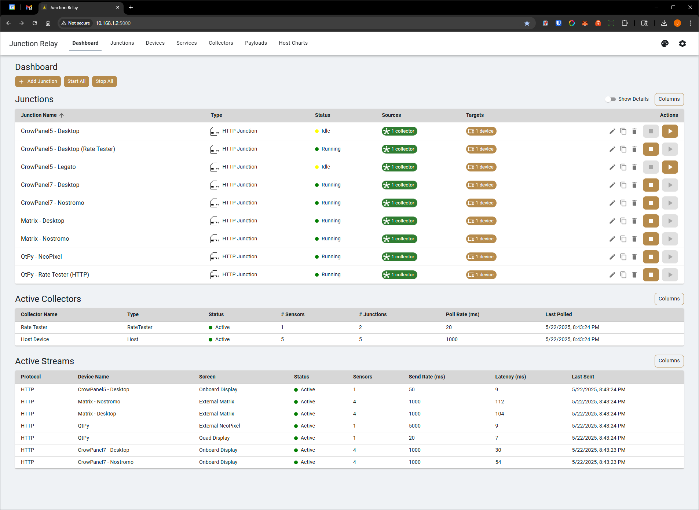
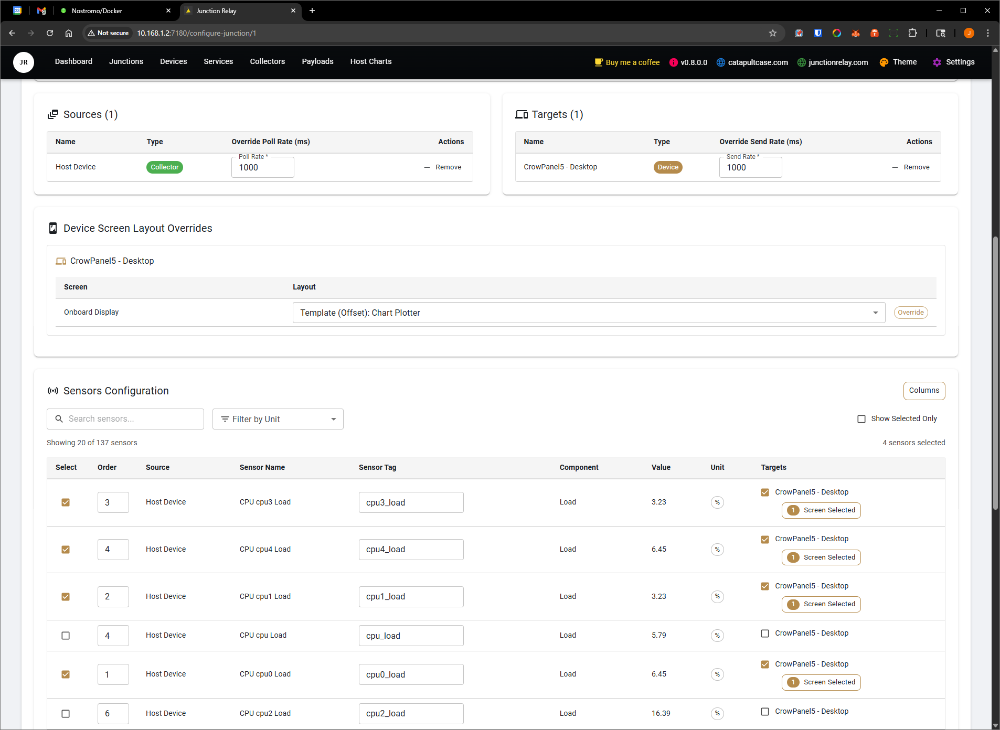
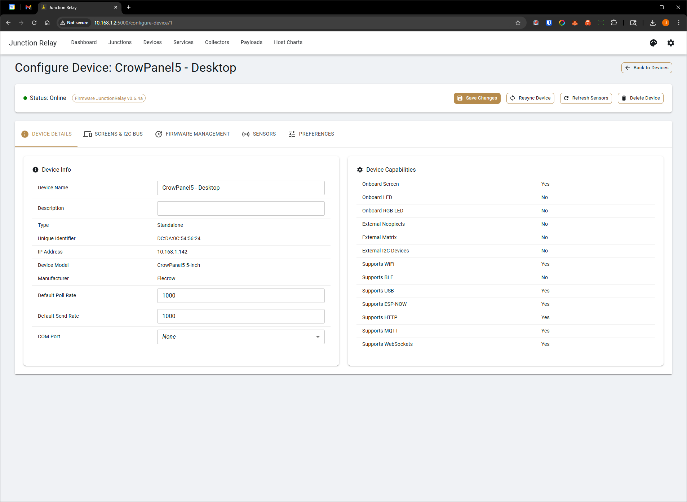
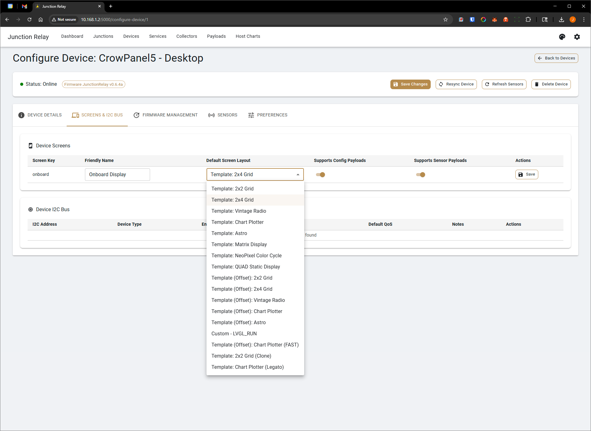
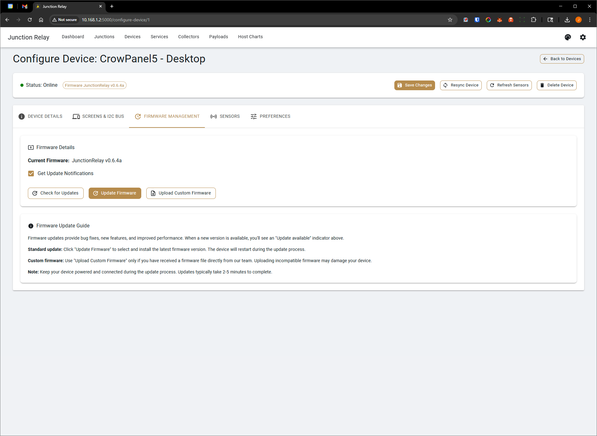
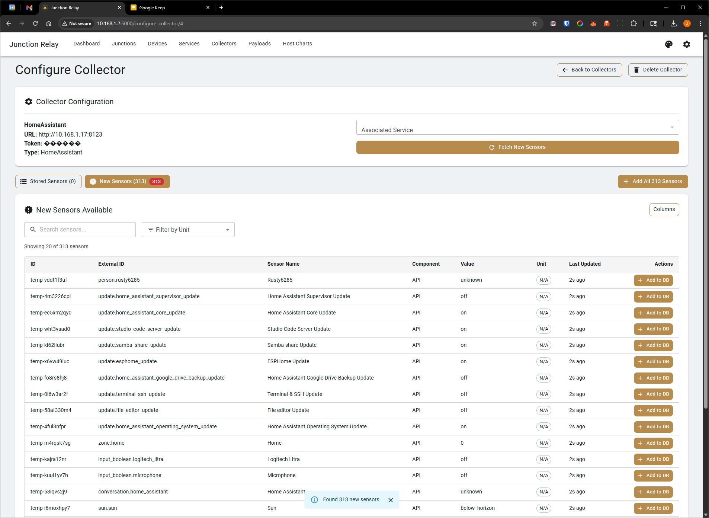
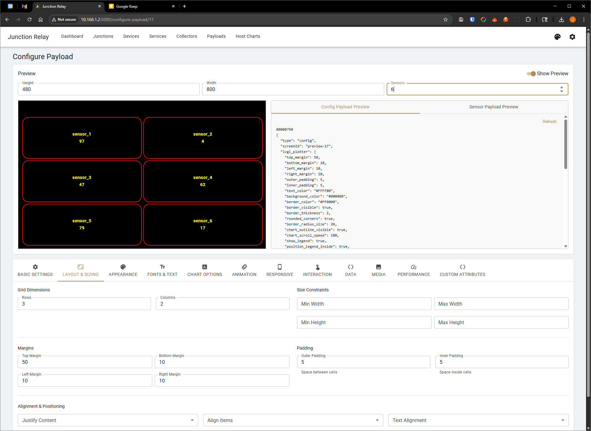

# Junction Relay

**Junction Relay** is a modular, open-source platform for real-time device and sensor coordination. Built for rapid deployment via Docker, it features a robust `.NET 8` backend and a modern React frontend for managing dynamic layouts, sensor data flows, and device orchestration across smart infrastructure.

🔗 [Visit junctionrelay.com](https://junctionrelay.com)

---

## 🚦 Overview

Junction Relay serves as a central hub for connected hardware—sensors, microcontrollers, and display screens. It manages real-time data collection, collation, routing, and visualization with minimal setup.

Originally designed to communicate with ESP32 devices, the system has evolved into a flexible backend-frontend stack deployable on everything from Raspberry Pi clusters to industrial-grade servers.

Most importantly, **Junction Relay connects seamlessly with existing services** like:

- 🏠 **Home Assistant**
- 🖥️ **LibreHardwareMonitor**
- 📡 **MQTT Brokers**
- 📈 **Uptime Kuma**
- 💻 **Native Host Machine Sensors**

This allows you to **consolidate data** from your smart home, PC hardware, servers, and monitoring dashboards into a single orchestrated control interface.

---

## 🧩 Key Features

- 📦 **Containerized Deployment** — Launch instantly using Docker or compile for Windows
- 🌐 **Modern React Web UI** — Intuitive browser-based control and configuration
- ⚙️ **Modular .NET 8 Backend** — RESTful API support and robust data handling
- 🔄 **Multi-Protocol Output** — Supports LVGL, MQTT, and custom formats
- 🖥️ **Visual Screen Editor** — Build LVGL-based UI layouts directly from the web
- 🔌 **Device Discovery** — Scan the network for compatible hardware and manage them remotely
- 🚀 **OTA Firmware Flashing** — Push firmware updates to supported devices wirelessly
- 🔋 Optimized for low-power hardware like the ESP32-S3

---

## 📡 Built-in Data Collectors

Junction Relay includes out-of-the-box collectors for:

- 🖥️ **Host Device** — Collect data from the system running Junction Relay
- 🏠 **Home Assistant** — Pull real-time sensor values from your smart home setup
- 📟 **LibreHardwareMonitor** — Monitor PC internals (CPU temps, fan speeds, voltages, etc.)
- 📈 **Uptime Kuma** — Ingest service and uptime metrics from your existing Uptime Kuma instance
- 📡 **MQTT Broker** — Ingest data from any MQTT-compatible sensor or service

💬 Want more integrations? [Request additional collectors in Discussions »](https://github.com/catapultcase/JunctionRelay/discussions)

---

## 🤝 Contributing

We welcome contributions from the community!

Whether it's fixing a bug, adding a new feature, improving documentation, or building a new data collector, your input helps Junction Relay grow.

- 🧩 Open an [Issue](https://github.com/catapultcase/JunctionRelay/issues) for bugs, feature requests, or questions  
- 🔀 Submit a [Pull Request](https://github.com/catapultcase/JunctionRelay/pulls) with your improvements  
- 💬 Join the conversation in [Discussions](https://github.com/catapultcase/JunctionRelay/discussions)

Please review our [Contribution Guidelines](./CONTRIBUTING.md) before submitting a PR.

By contributing, you agree that your code will be released under the same [GPLv3 license](./LICENSE) as the rest of the project.

---

## 🚀 Quick Start

### Prerequisites

- Docker & Docker Compose  
- Node.js (for local frontend development)  
- .NET 8 SDK (for local backend development)  

### Deployment via Docker

```bash
git clone https://github.com/catapultcase/JunctionRelay.git
cd JunctionRelay
docker build -t junctionrelay .
docker run -p 7180:7180 junctionrelay

```

### Screenshots

#### Plotters


#### UI Thumbnails

| Dashboard | Configure Junction | Device - Step 1 |
|---|---|---|
|  |  |  |

| Device - Step 2 | Device - Step 3 | Configure Collector |
|---|---|---|
|  |  |  |

| Configure Payload |
|---|
|  |