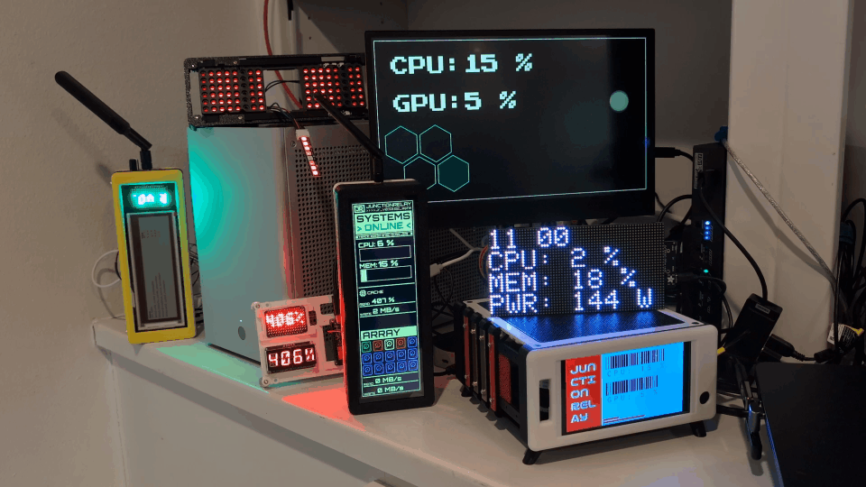
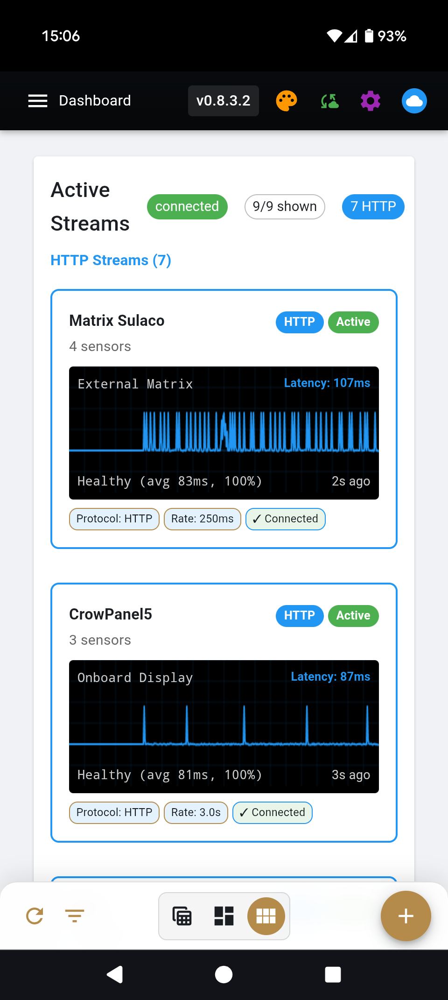
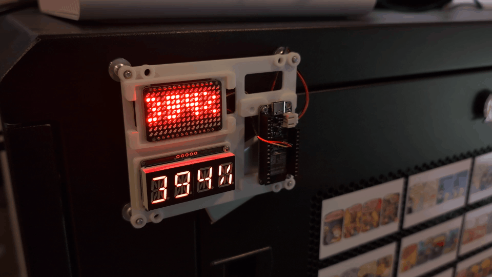
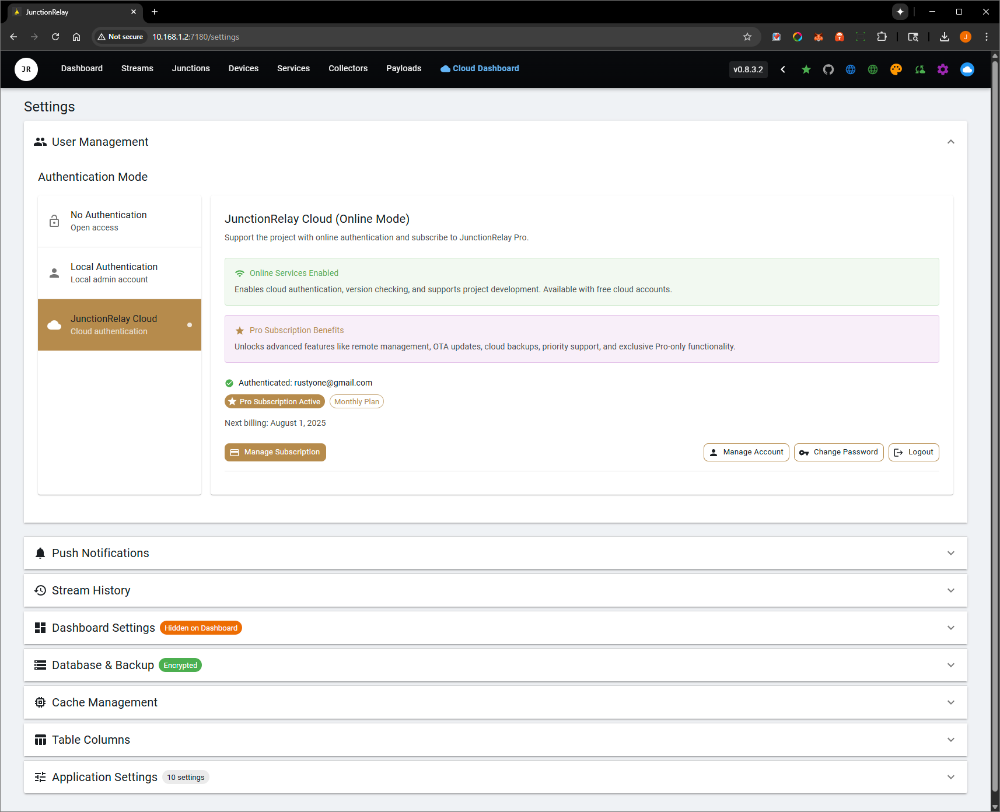

# JunctionRelay

## Unified Data Orchestration & IoT Device Management

**Local-first. Cloud-optional.**
Connect, transform, and display your data anywhere.

## 📚 Documentation

Full user and developer documentation is available at:

➡️ [https://junctionrelay-docs.onrender.com](https://junctionrelay-docs.onrender.com)

---

---

## Core Project Goals

1. **Device Streaming Orchestration**
2. **IoT Device Monitoring & Management**

---

## Overview

JunctionRelay serves as a central hub for connected hardware: sensors, microcontrollers, and display screens. It manages real-time data collection, collation, routing, and visualization with minimal setup. Primarily designed to communicate with ESP32 devices embedded into CatapultCase designs, the system has evolved into a flexible backend-frontend stack deployable on everything from Raspberry Pi clusters to industrial-grade servers, now with cloud integration for simplified device management.

This allows you to consolidate data from your smart home, PC hardware, servers, monitoring dashboards, and cloud-managed IoT devices into a single orchestrated control interface.

---

## Key Features

* Containerized Deployment (launch instantly using Docker or compile for Windows)
* Modern React Web UI (intuitive browser-based control and configuration)
* Modular .NET 8 Backend (RESTful API support and robust data handling)
* Cloud Device Management (manage ESP32 devices through secure cloud registration)
* Multi-Protocol Output (supports LVGL, MQTT, and custom formats)
* Visual Screen Editor (build LVGL-based UI layouts directly from the web)
* Device Discovery (scan the network for compatible hardware and manage them remotely)
* Over-the-Air Firmware Flashing (push official JunctionRelay firmware to supported devices wirelessly)
* Small Footprint (optimized for low-power hardware like ESP32-S3)

---

## Built-in Data Collectors

JunctionRelay includes out-of-the-box collectors for:

- **Cloud Devices** – Monitor and collect data from cloud-registered ESP32 devices  
- **Cloudflare** – Track traffic and analytics from your Cloudflare-protected domains  
- **GitHub** – Monitor repository stats, activity, issues, and more  
- **Home Assistant** – Pull real-time sensor values from your smart home setup  
- **Host Device** – Collect data from the system running JunctionRelay  
- **LibreHardwareMonitor** – Monitor PC internals: CPU temperatures, fan speeds, voltages, etc  
- **MQTT Brokers** – Connect to your MQTT broker to exchange data with mosquitto devices
- **NeoPixel Color Generator** – Show off your NeoPixel LED RGB
- **Rate Tester** – Test the performance of your implementations
- **Render.com** – Fetch deployment and service status from your Render projects  
- **Sonarr** – Feed your upcoming TV shows to your displays  
- **Stripe** – Pull live subscription, payment, and revenue metrics from your Stripe account  
- **Unraid** – Connect via Unraid API to get metrics directly from your server   
- **Uptime Kuma** – Ingest service and uptime metrics from your existing Uptime Kuma instance 

Want more integrations? [Request additional collectors in Discussions](https://github.com/catapultcase/JunctionRelay/discussions)

---

## IoT Device Monitoring and Management

Monitor existing devices or add JunctionRelay support with minimal changes.

* **Plug-and-play device monitoring**
* **Drop-in Arduino example code**
* **Track health status** with real-time heartbeats and uptime
* **Optional Cloud mode** enables push notifications for device health

---

## Native Mobile App

* Official Android app connects to your local and cloud backends  
* Enables Push notifications for devices you choose to sync to the cloud  
* Mobile-first design philosophy for the entire application  

  
  
  

---

## Cloud Device Integration

JunctionRelay now supports cloud-managed ESP32 devices for simplified deployment and management. This allows you to register ESP32 devices through a secure cloud service and have them automatically appear in your local JunctionRelay instance.

### Cloud Device Benefits

* Zero Configuration (no network discovery or manual device setup required)
* Secure Registration (token-based device registration with user approval workflow)
* Automatic Management (devices appear automatically in your JunctionRelay instance)
* Remote Monitoring (monitor device health and status through the cloud dashboard)
* Seamless Integration (cloud devices work alongside local devices in the same interface)

---

### 🚀 Example Builds

| Adafruit Feather ESP32 S3 | Adafruit QtPy ESP32 S3 | SparkleMotion Mini |
|---------------------------|-------------------------|---------------------|
|  |  |  |

| CrowPanel 5” – Plotters | CrowPanel 7” – Grids |  |
|------------------------|----------------------|--|
|  |  | &nbsp; |

---

### UI Screenshots

| Dashboard                        | Cloud Dashboard                   | Devices                         |
|:--------------------------------:|:----------------------------------:|:-------------------------------:|
|  |  |  |

| Device Stats                    | Payloads                          | Settings                        |
|:-------------------------------:|:---------------------------------:|:-------------------------------:|
|  |  |  |

| Configure Device 1             | Configure Device 2               | Stream Monitor                  |
|:------------------------------:|:--------------------------------:|:-------------------------------:|
|  |  |  |

---

## Contributing

We welcome contributions! Whether you are fixing bugs, adding features, or improving documentation, your help makes JunctionRelay better for everyone.

* Bug Reports: [Open an issue](https://github.com/catapultcase/JunctionRelay/issues)
* Feature Requests: [Start a discussion](https://github.com/catapultcase/JunctionRelay/discussions)
* Documentation: Help improve our guides and examples
* Device Integrations: Add support for new hardware or protocols