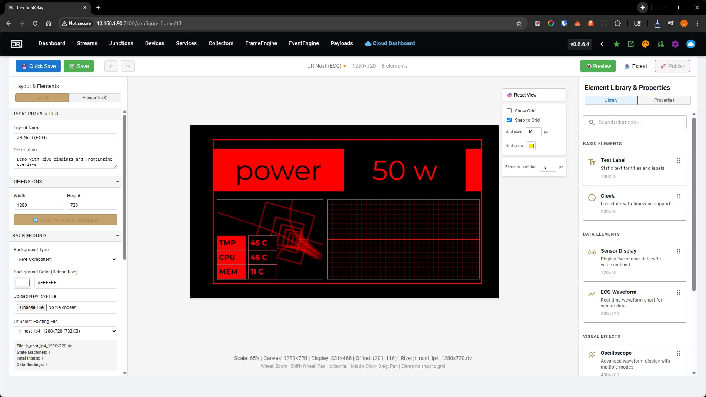

# JunctionRelay

## Multi-platform OSD Designer for Connected Devices

**Design once. Deploy everywhere.**
Build custom interfaces with the FrameEngine and push them to any display.

---

🔴 [YouTube @catapultcase](https://www.youtube.com/@catapultcase)  
📚 [Documentation](https://junctionrelay-docs.onrender.com)

---

---

## Primary Focus: FrameEngine Multi-platform OSD Designer

JunctionRelay's **FrameEngine** is a powerful visual design system that lets you create sophisticated heads-up displays and data interfaces through an intuitive web-based editor. Design layouts, configure data sources, and deploy custom UIs to ESP32 devices, screens, dashboards and more.

### FrameEngine Features

* **Visual Layout Editor** – Drag-and-drop interface builder for creating custom multi-platform OSDs
* **Real-time Preview** – See your designs update instantly as you configure them
* **Component Library** – Pre-built widgets for charts, effects, sensor displays, and more
* **Rive Integration** – Leverage [Rive](https://rive.app/) to build interactive, stateful graphics
* **Data Binding** – Connect any data source to any visual element with simple mapping
* **EventEngine** – Define rule based logic to manipulate sensor values in real-time
* **FrameXchange** – Share and download designs from the community
* **DeviceXchange** – Share and discover complete device projects with the community
* **Virtual Device Software** – Display your creations in browsers, on hardware, or via the desktop Virtual Device app

---

## Supporting Capabilities

### Device Streaming Orchestration

Seamlessly route data from collectors to devices with flexible transformation pipelines. Support for multiple protocols (WebSockets, HTTP, COM, MQTT) ensures compatibility with diverse hardware ecosystems.

### IoT Device Management

Monitor and manage ESP32 devices with:
* Cloud-based device registration and management
* Over-the-air firmware updates
* Network discovery for local devices
* Health monitoring with heartbeat tracking
* Push notifications via mobile app integration

---

## Overview

JunctionRelay serves as a central hub for connected hardware: sensors, microcontrollers, and display screens. At its core is the FrameEngine - a multi-platform OSD designer that transforms how you build interfaces for embedded displays. Design sophisticated dashboards in your browser, then deploy them instantly to ESP32 devices running on everything from tiny 1.14" screens to large touch panels.

Originally designed for ESP32 devices embedded in CatapultCase hardware, JunctionRelay has evolved into a complete visualization platform. The containerized stack deploys on Raspberry Pi clusters, development machines, or cloud servers, with optional cloud integration for simplified device management.

Consolidate data from smart home sensors, PC hardware monitors, server metrics, cloud services, and IoT devices into unified visual interfaces - designed once, deployed anywhere.

---

## Key Features

* **FrameEngine Visual Designer** – Browser-based multi-platform OSD creation tool with real-time preview
* **Containerized Deployment** – Launch instantly using Docker or deploy directly on your Operating System
* **Modern React Web UI** – Intuitive interface for design, configuration, and monitoring
* **Modular .NET 8 Backend** – RESTful API with robust data handling and transformation
* **Cloud Device Management** – Secure registration and management of ESP32 devices
* **Component Library** – A growing collection of pre-built multi-platform OSD widgets and controls
* **Device Discovery** – Automatic detection and configuration of compatible hardware
* **OTA Firmware Flashing** – Wireless firmware updates for supported JunctionRelay devices
* **Small Footprint** – Optimized for low-power hardware like ESP32-S3 and the Raspberry Pi ecosystem

---

## Built-in Data Collectors

JunctionRelay includes out-of-the-box collectors for:

- **Cloud Devices** – Monitor and collect data from cloud-registered ESP32 devices (in development)  
- **Cloudflare** – Track traffic and analytics from your Cloudflare-protected domains  
- **Generic API** – Connect to any JSON API endpoint with custom authentication
- **GitHub** – Monitor repository stats, activity, issues, and more  
- **Home Assistant** – Pull real-time sensor values from your smart home setup  
- **Host Device** – Collect data from the operating system system running JunctionRelay Server 
- **HWiNFO** – Real-time hardware monitoring via shared memory
- **iCal** – Monitor calendar events from Google, Outlook, Apple, or any iCal feed
- **Internet Time** – Network-synchronized UTC time with multiple fallback sources
- **LibreHardwareMonitor** – Monitor PC internals: CPU temperatures, fan speeds, voltages, etc  
- **MQTT Brokers** – Connect to your MQTT broker to exchange data with IoT devices
- **NeoPixel Color** – Control and monitor RGB LED strips and displays
- **Rate Tester** – Benchmark and optimize your data pipelines
- **Render.com** – Fetch deployment and service status from your Render projects  
- **Sonarr Calendar** – Display upcoming TV show schedules on your screens  
- **SSH Linux** – Monitor remote Linux systems via SSH (CPU, memory, disk, network, temperature)
- **Stripe** – Live subscription, payment, and revenue metrics from your Stripe account
- **System Time** – Local system time reference with timezone information  
- **Unraid** – Server metrics directly from your Unraid GraphQL API   
- **Uptime Kuma** – Service and uptime metrics from your monitoring instance

Want more integrations? [Request additional collectors in Discussions](https://github.com/catapultcase/JunctionRelay/discussions)

---

## Design-First Workflow

1. **Design** – Use the FrameEngine to build your multi-platform OSD in the browser
2. **Connect** – Link data sources to visual components with simple bindings
3. **Preview** – See real-time updates as data flows through your design
4. **Deploy** – Push your completed interface to any compatible device
5. **Monitor** – Track device health and data flow from the dashboard
6. **Share** – Upload to FrameXchange or DeviceXchange to share with the community

---

## IoT Device Monitoring and Management

Monitor existing devices or add JunctionRelay support with minimal changes.

* **Plug-and-play device monitoring**
* **Drop-in Arduino example code**
* **Track health status** with real-time heartbeats and uptime
* **Optional cloud mode** enables push notifications for device health

---

## Native Mobile App

* Official Android app connects to your local and cloud backends  
* Enables push notifications for devices you choose to sync to the cloud  
* Mobile-first design philosophy for the entire application  

  
  
  

---

## Cloud Device Integration

JunctionRelay supports cloud-managed ESP32 devices for simplified deployment. Register ESP32 devices through a secure cloud service and have them automatically appear in your local JunctionRelay instance - no network configuration required.

### Cloud Device Benefits

* **Zero Configuration** – No network discovery or manual device setup required
* **Secure Registration** – Token-based device registration with user approval workflow
* **Automatic Management** – Devices appear automatically in your JunctionRelay instance
* **Remote Monitoring** – Monitor device health and status through the cloud dashboard
* **Seamless Integration** – Cloud devices work alongside local devices in the same interface

---

### 🚀 Example Builds

See what's possible with JunctionRelay and the FrameEngine.

| Adafruit Feather ESP32 S3 | Adafruit QtPy ESP32 S3 | SparkleMotion Mini |
|---------------------------|-------------------------|---------------------|
|  |  |  |

| CrowPanel 5" – Plotters | CrowPanel 7" – Grids |  |
|------------------------|----------------------|--|
|  |  | &nbsp; |

---

### UI Screenshots

| Dashboard                        | Cloud Dashboard                   | Devices                         |
|:--------------------------------:|:----------------------------------:|:-------------------------------:|
|  |  |  |

| Device Stats                    | Payloads                          | Settings                        |
|:-------------------------------:|:---------------------------------:|:-------------------------------:|
|  |  |  |

| Configure Device 1             | Configure Device 2               | Stream Monitor                  |
|:------------------------------:|:--------------------------------:|:-------------------------------:|
|  |  |  |

---

## License and Source Code

JunctionRelay is **semi-open-source** software with a hybrid licensing model:

### Open-Source Components (GPL-3.0)

The following components are fully open-source under the [GNU General Public License v3.0](LICENSE.txt):

* **.NET 8 Backend** – Complete source code for the RESTful API server
* **React Web UI** – Full source for the dashboard and management interface
* **Data Collectors** – All collector implementations
* **Device Management** – Cloud integration, discovery, and OTA update systems
* **Build Scripts** – Docker configurations and deployment tools

### Proprietary Components (Compiled Binaries Only)

**FrameEngine** is proprietary software distributed in **compiled form only**:

* ✅ **Included**: Minified, obfuscated JavaScript binaries
* ✅ **Included**: TypeScript type definitions (.d.ts files)
* ❌ **Not Included**: FrameEngine source code
* 📜 **License**: Proprietary - usage permitted only with JunctionRelay Server

The compiled FrameEngine library is located at:
- `junctionrelaywebui/vendor/@junctionrelay/frameengine/` (vendor distribution)
- `junctionrelaywebui/node_modules/@junctionrelay/frameengine/` (runtime)

### What This Means For You

**You CAN:**
- ✅ Use JunctionRelay Server freely for personal or commercial purposes
- ✅ Modify and redistribute the open-source components
- ✅ Use the FrameEngine binaries as part of JunctionRelay Server
- ✅ Build custom data collectors and integrations
- ✅ Fork and customize the backend and web UI

**You CANNOT:**
- ❌ Decompile, reverse engineer, or extract the FrameEngine source code
- ❌ Use FrameEngine binaries outside of JunctionRelay Server
- ❌ Redistribute FrameEngine separately from JunctionRelay Server

**Why This Model?**

FrameEngine represents significant proprietary development and is the core intellectual property of JunctionRelay. The hybrid model allows us to:
- Share the full server infrastructure with the community
- Protect our competitive advantage and development investment
- Enable developers to build on JunctionRelay while preserving our IP
- Continue offering the complete platform at no cost

---

## Contributing

We welcome contributions to the open-source components! Whether you are fixing bugs, adding features, or improving documentation, your help makes JunctionRelay better for everyone.

**Contribution Guidelines:**
* Open-source components (backend, web UI, collectors) are welcome for contributions
* FrameEngine improvements should be requested via feature requests
* All contributions must comply with the GPL-3.0 license for open-source components

**How to Contribute:**
* Bug Reports: [Open an issue](https://github.com/catapultcase/JunctionRelay/issues)
* Feature Requests: [Start a discussion](https://github.com/catapultcase/JunctionRelay/discussions)
* Documentation: Help improve our guides and examples
* Device Integrations: Add support for new hardware or protocols