# JunctionRelay

**Design once. Deploy everywhere.**

JunctionRelay is a self-hosted hub for connected hardware and the machines around it. Design
on-screen displays in the browser with the FrameEngine and stream them to ESP32 screens, desktops
and dashboards. Pull data in from sensors, servers and cloud services. And keep a structured record
of your homelab and your local LLM fleet, readable and writable by AI agents over MCP.

🔴 [YouTube @catapultcase](https://www.youtube.com/@catapultcase)
📚 [Documentation](https://junctionrelay-docs.onrender.com)
🌐 [junctionrelay.com](https://junctionrelay.com)

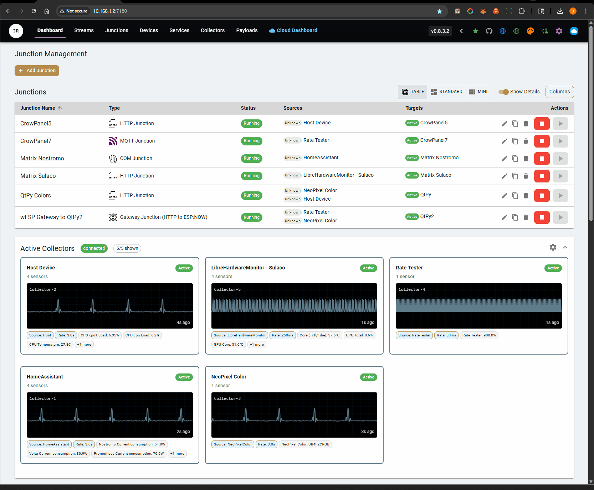
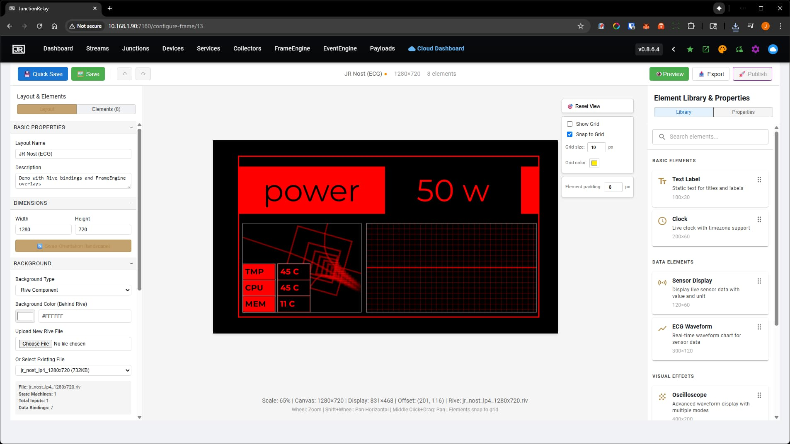
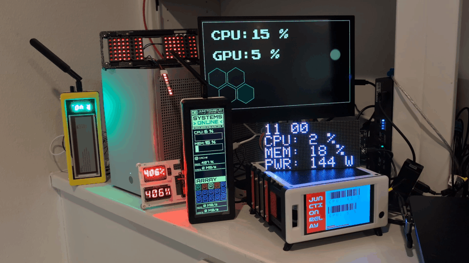

---

## What's inside

The web UI is a set of apps that share one server and one database:

| App | What it does |
|---|---|
| 🛰️ **Server** | The FrameEngine designer, devices, junctions (data routes), collectors, payloads, the EventEngine, streams and settings |
| 🏠 **Homelab** | Inventory of machines and parts, racks and rooms, the network topology, backups, and price history |
| 🧠 **Models** | Your local LLM fleet: the model catalog, what each machine serves, benchmarks and reports |
| 📖 **Documentation** | Browse your own MkDocs sites from inside the app |
| ☁️ **Cloud** | Optional JunctionRelay Cloud: device registration, backups, sync and the cloud MCP |

---

## FrameEngine – multi-platform OSD designer

* **Visual layout editor** – drag-and-drop builder for on-screen displays at any resolution
* **Real-time preview** – designs update live as sensor data flows in
* **Component library** – gauges, charts, text, media, effects, and sensor displays
* **Rive integration** – interactive, stateful [Rive](https://rive.app/) graphics bound to live data
* **Shaders** – GPU shader effects as layers and backgrounds
* **Data binding** – connect any sensor to any element with a simple mapping
* **EventEngine** – rule-based logic that transforms sensor values in real time
* **Render modes** – send devices a compact *payload* to draw themselves, *composite* frames assembled on the device, or fully *pre-rendered (blit)* frames for screens that only show pixels
* **FrameXchange / DeviceXchange** – share and download layouts and complete device projects
* **Virtual devices** – show your designs in a browser, on hardware, or in the desktop Virtual Device app

---

## Devices and data

### Streaming

Junctions route data from collectors to devices, over **WebSocket, HTTP, MQTT or serial (COM)**,
at a rate you set per junction.

### Device management

* Network discovery of local devices
* Over-the-air firmware updates
* Health monitoring with heartbeats
* Cloud registration for devices that need no network setup
* Push notifications through the Android app

### Collectors

Built in:

| | | |
|---|---|---|
| Cloudflare | GitHub | Host device (CPU, memory, disks, network) |
| HWiNFO | iCal calendars | LibreHardwareMonitor |
| MQTT brokers | NeoPixel colour | Rate tester |
| Render.com | Sonarr calendar | SSH Linux hosts |
| Stripe | Unraid (GraphQL) | Uptime Kuma |

Shipped as plugins: Home Assistant, Generic JSON API, Internet Time, System Time, OpenWeather,
Windows host metrics and Claude usage.

**Plugins** extend the server without rebuilding it: collector plugins (a separate process over
JSON-RPC), FrameEngine element plugins, payload plugins and shader plugins, installed from a zip.
Want an integration? [Ask in Discussions](https://github.com/catapultcase/JunctionRelay/discussions).

### Grafana

`/api/grafana` exposes junction states, sensor time series and system metrics for Grafana.

---

## Homelab

A structured record of your hardware, replacing spreadsheets and notes that drift:

* **Machines and parts** – every machine and the components inside it, with specs per component type (types and their fields are editable)
* **Shelf and movements** – spare parts, what moved where and when, retired and sold parts
* **Prices** – launch price, invoice price and what you paid, plus a dated market-value history
* **Paperwork** – invoices and documents attached to each part
* **Spaces and rooms** – racks (with a U-by-U elevation), desks and shelves, nested inside rooms
* **Network** – a topology map built from your inventory: a switch or NIC brings its ports with it; links are drawn port to port, live or planned
* **Backups** – your backup strategy read as 3-2-1: every data set, every copy, which box holds it, what is offsite (including cloud storage), and the jobs that make the copies

## Models

For anyone running local LLMs across several machines:

* **Catalog** – the models you hold, with published reference scores
* **Serving** – which machine serves which model, at what quant, context window and slots, drawn as one picture of who asks whom
* **Benchmarks** – a matrix of measured speed (prefill, tokens/s, time to first token) per exact setup and machine, including setups that would not load and why
* **Reports** – speed over time, and how mixture-of-experts models behave as layers move to system RAM

Benchmarks follow a public, versioned contract
([`docs/BENCHMARK-CONTRACT.md`](JunctionRelay_Server/docs/BENCHMARK-CONTRACT.md)), so any test
harness can post results.

## MCP for AI agents

JunctionRelay is an [MCP](https://modelcontextprotocol.io) server. Point Claude, or any MCP client,
at `http://<your-server>:7180/mcp` with the key from **Settings**, and the agent can read and update
the Homelab and Models data: file a purchase from an invoice, move a part, record a benchmark,
rearrange a rack, wire the network map. The web UI and the agent use the same rules, so
neither can write something the other would refuse.

* **Local MCP** – free, live, and the source of truth
* **Cloud MCP** – read-only access to your synced mirror from anywhere (JunctionRelay Cloud Pro)

---

## JunctionRelay Cloud (optional)

* **Cloud devices** – register ESP32 devices with a token and approve them; they appear in your server with no network setup
* **Cloud backups** – scheduled backups of your server
* **Cloud sync** – a push-only mirror of your Homelab and Models data for the cloud dashboard and cloud MCP. Nothing comes back down, and private fields (addresses, notes) never leave your server
* **Sign-in** – use your cloud account, or keep the server local-only with its own login

---

## Quick start (Docker)

```bash
docker run -d --name junctionrelay \
  -p 7180:7180 \
  -v /path/to/appdata:/app/data \
  catapultcase/junctionrelay:latest
```

Open `http://<host>:7180`. All data lives in `/app/data`. Images are published for x64 and arm64,
so a Raspberry Pi works too. Unraid users can install it from Community Applications.

---

## Android app

* Connects to your local server and to the cloud
* Push notifications for devices you sync to the cloud

<p float="left">
  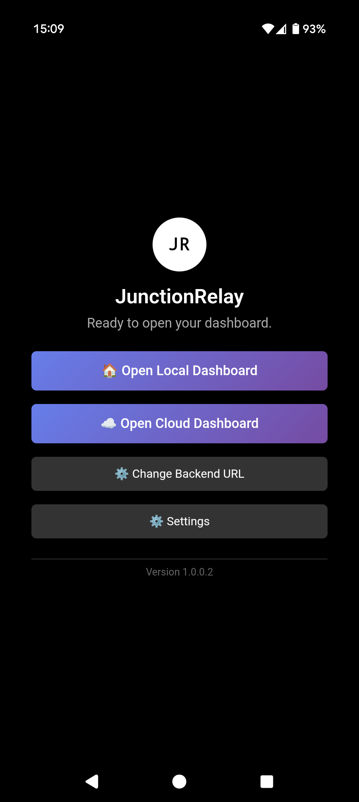
  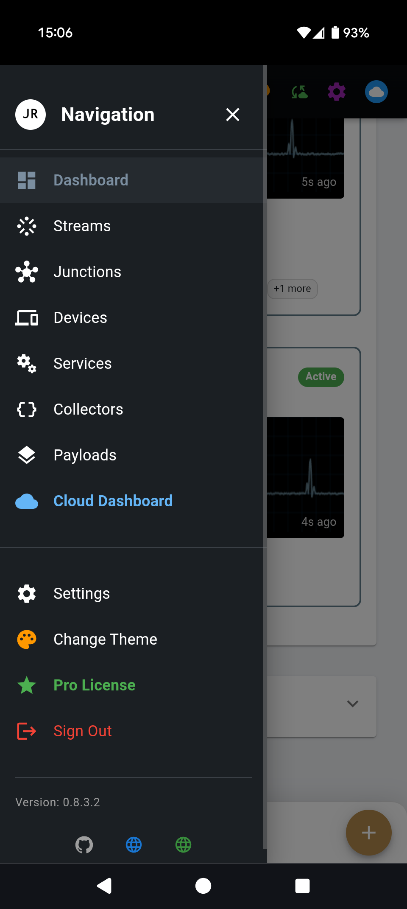
  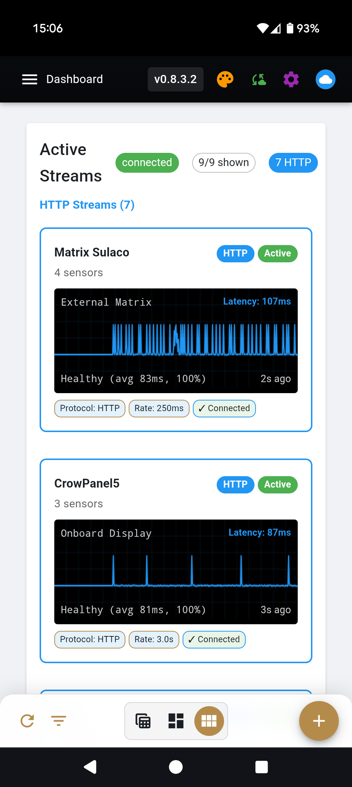
</p>

---


### Example builds

| Adafruit Feather ESP32 S3 | CrowPanel 5" | Rack display |
|:---:|:---:|:---:|
| [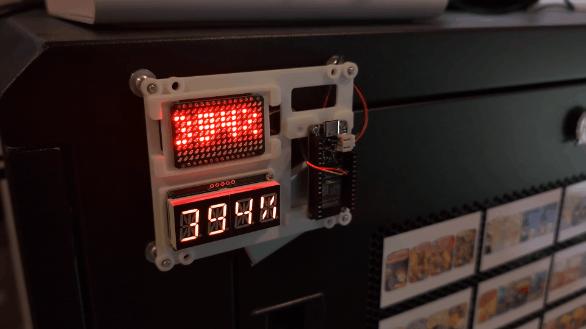](https://junctionrelay-docs.onrender.com/examples/feather/) | 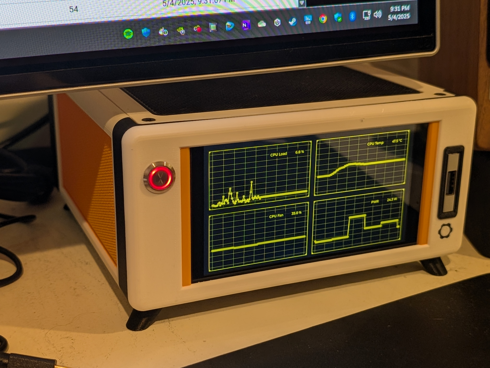 | 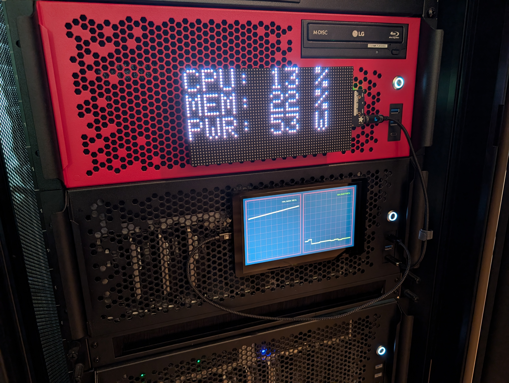 |

### Screenshots

| Dashboard | Cloud Dashboard | Devices |
|:---:|:---:|:---:|
| 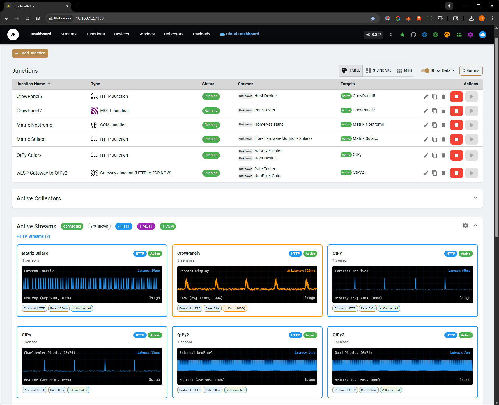 | 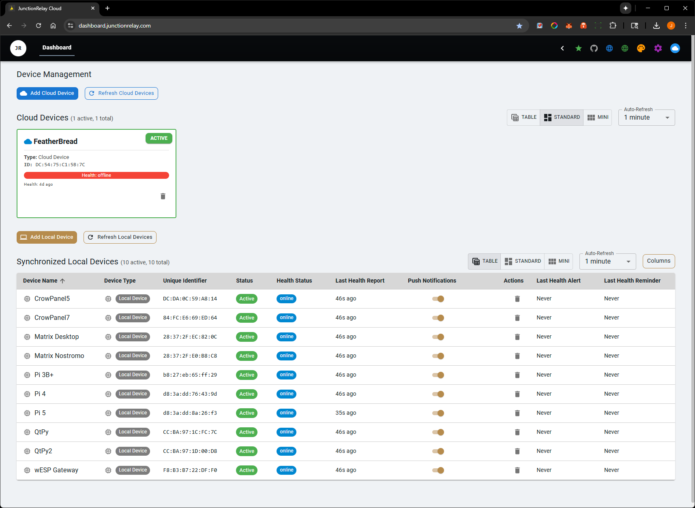 | 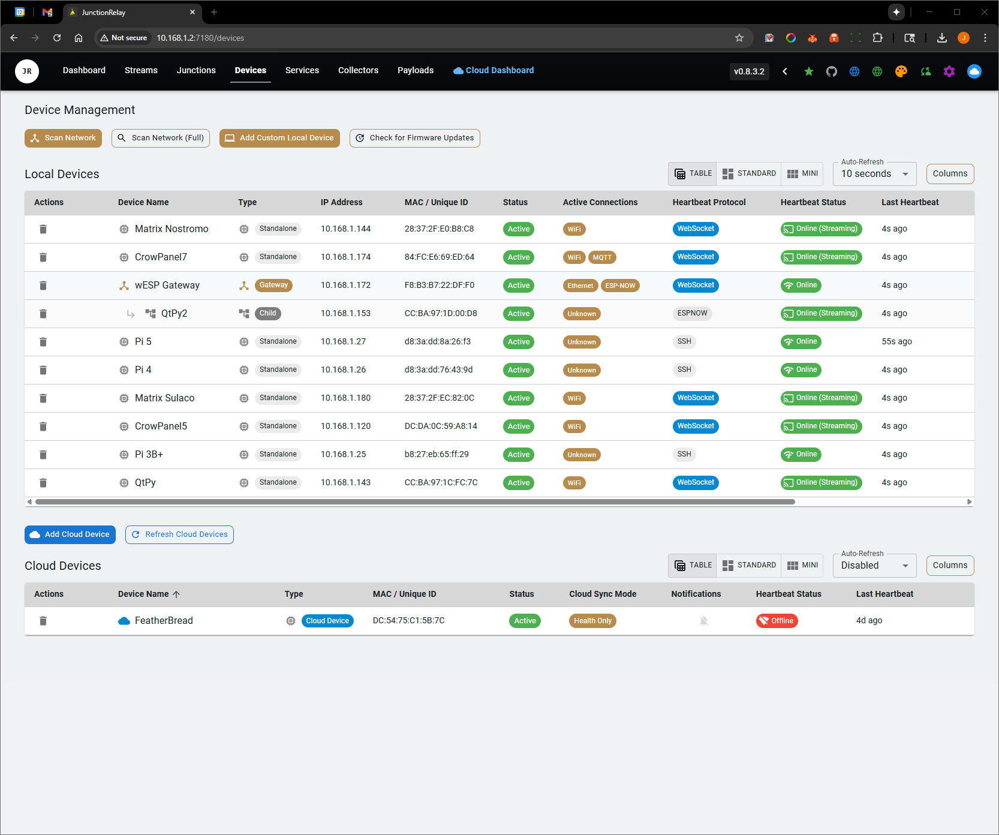 |

| Device Stats | Payloads | Settings |
|:---:|:---:|:---:|
| 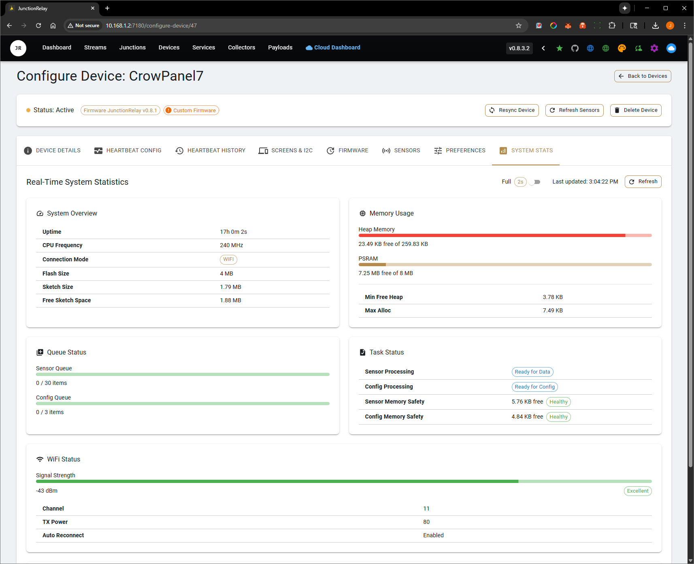 | 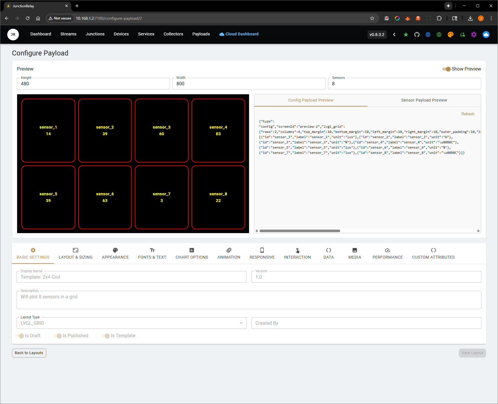 | 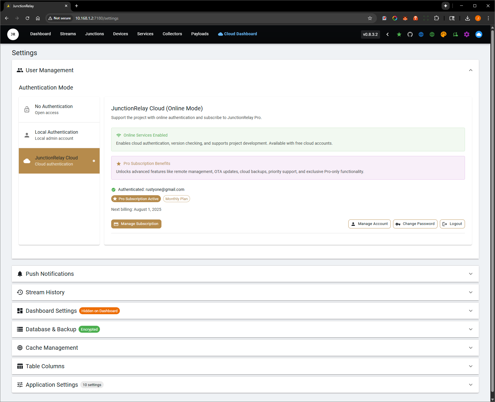 |

| Configure Device 1 | Configure Device 2 | Stream Monitor |
|:---:|:---:|:---:|
| 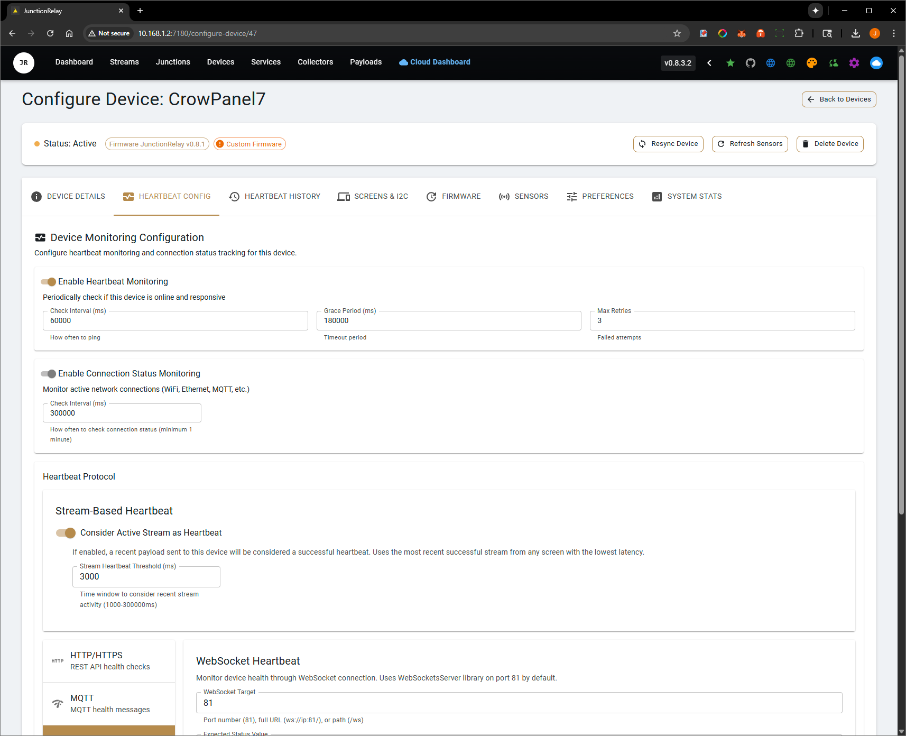 | 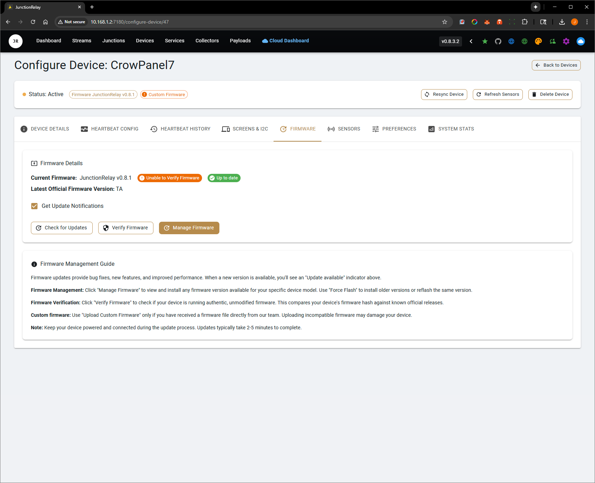 | 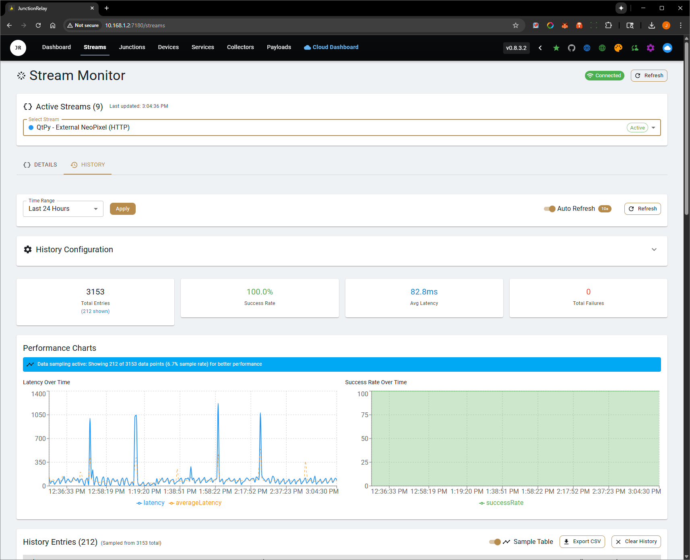 |

---

## Repository layout

| Path | Contents |
|---|---|
| `JunctionRelay_Server/` | The .NET 8 server (`Controllers/`, `Services/`, `Models/`, `Collectors/`) and the React web UI (`junctionrelaywebui/`) |
| `JunctionRelay_Server/docs/` | Public contracts, such as the benchmark contract |
| `JunctionRelay_ESP32_*` | Firmware for the supported ESP32 boards (Arduino) |
| `Device Examples/` | Example device builds |
| `assets/` | Images used in this README |

---

## License and source code

JunctionRelay is open core.

### Open source (GPL-3.0)

Under the [GNU General Public License v3.0](LICENSE.txt):

* The .NET 8 server
* The React web UI
* The collectors, Homelab, Models and MCP modules
* The device firmware

Third-party licences are listed in [`LICENSES-THIRD-PARTY.txt`](LICENSES-THIRD-PARTY.txt) and
[`JunctionRelay_Server/THIRD-PARTY-LICENSES.txt`](JunctionRelay_Server/THIRD-PARTY-LICENSES.txt).

### FrameEngine (proprietary)

The **FrameEngine** library is proprietary. It is **not in this repository**: it ships compiled
(minified and obfuscated) inside the JunctionRelay Docker image, and may be used only as part of
JunctionRelay Server. Building the web UI from source needs the FrameEngine package
(`@junctionrelay/frameengine`), which is not published here.

**You can:**
- ✅ Use JunctionRelay Server freely, for personal or commercial purposes
- ✅ Modify and redistribute the open-source parts under the GPL-3.0
- ✅ Build your own collectors, plugins and integrations

**You cannot:**
- ❌ Decompile, reverse engineer or extract the FrameEngine
- ❌ Use the FrameEngine outside JunctionRelay Server, or redistribute it separately

---

## Contributing

Contributions to the open-source parts are welcome: bug fixes, features, collectors, device
support and documentation. Contributions are accepted under the GPL-3.0.

* Bugs: [open an issue](https://github.com/catapultcase/JunctionRelay/issues)
* Ideas and feature requests, including FrameEngine ones: [start a discussion](https://github.com/catapultcase/JunctionRelay/discussions)
