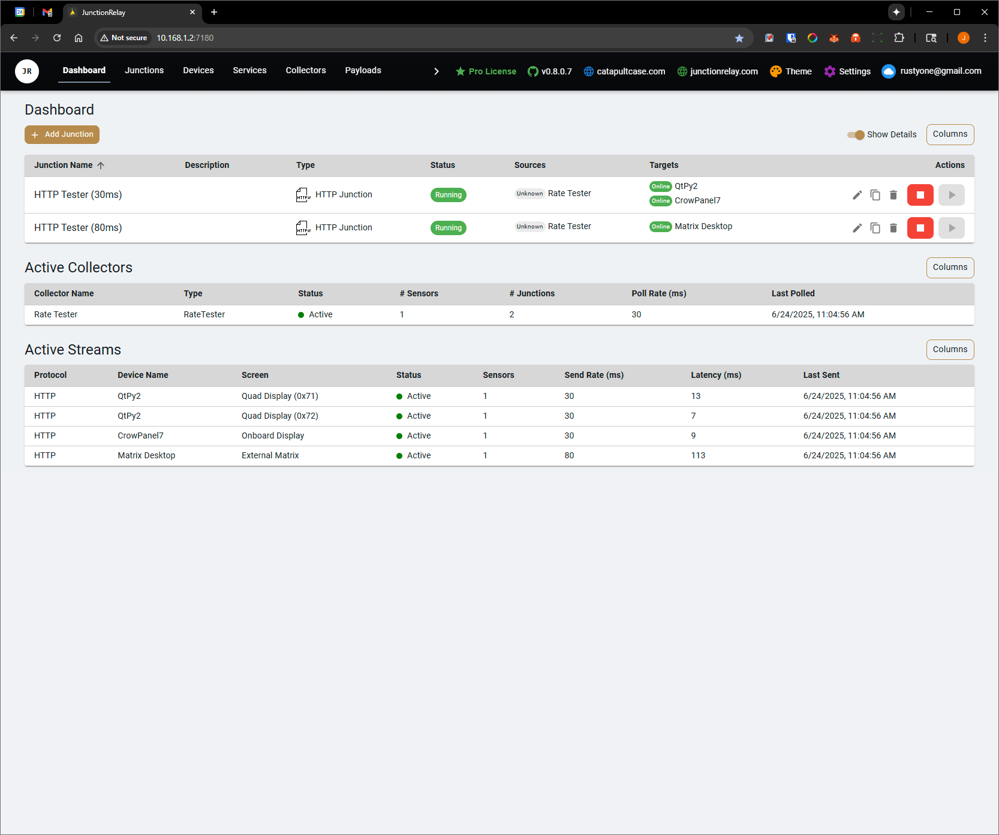

# Junction Relay

**Junction Relay** is an open-source modular platform for real-time device and sensor coordination. Built for rapid deployment via Docker, it features a robust `.NET 8` backend and a modern React frontend for managing dynamic layouts, sensor data flows, and device orchestration across smart infrastructure.

🔗 [Visit junctionrelay.com](https://junctionrelay.com)

---

## 🚦 Overview

Junction Relay serves as a central hub for connected hardware—sensors, microcontrollers, and display screens. It manages real-time data collection, collation, routing, and visualization with minimal setup.

Originally designed to communicate with ESP32 devices, the system has evolved into a flexible backend-frontend stack deployable on everything from Raspberry Pi clusters to industrial-grade servers.

Most importantly, **Junction Relay connects seamlessly with existing services** like:

- 🏠 **Home Assistant**
- 🖥️ **LibreHardwareMonitor**
- 📡 **MQTT Brokers**
- 📈 **Uptime Kuma**
- 💻 **Native Host Machine Sensors**

This allows you to **consolidate data** from your smart home, PC hardware, servers, and monitoring dashboards into a single orchestrated control interface.

---

## 🧩 Key Features

- 📦 **Containerized Deployment** — Launch instantly using Docker or compile for Windows
- 🌐 **Modern React Web UI** — Intuitive browser-based control and configuration
- ⚙️ **Modular .NET 8 Backend** — RESTful API support and robust data handling
- 🔄 **Multi-Protocol Output** — Supports LVGL, MQTT, and custom formats
- 🖥️ **Visual Screen Editor** — Build LVGL-based UI layouts directly from the web
- 🔌 **Device Discovery** — Scan the network for compatible hardware and manage them remotely
- 🚀 **OTA Firmware Flashing** — Push official Junction Relay firmware to supported devices wirelessly
- 🔋 **Small Footprint** — Optimized for low-power hardware like ESP32-S3

---

## 📡 Built-in Data Collectors

Junction Relay includes out-of-the-box collectors for:

- 🖥️ **Host Device** — Collect data from the system running Junction Relay
- 🏠 **Home Assistant** — Pull real-time sensor values from your smart home setup
- 📟 **LibreHardwareMonitor** — Monitor PC internals (CPU temps, fan speeds, voltages, etc.)
- 📈 **Uptime Kuma** — Ingest service and uptime metrics from your existing Uptime Kuma instance
- 📡 **MQTT Broker** — Ingest data from any MQTT-compatible sensor or service

💬 Want more integrations? [Request additional collectors in Discussions »](https://github.com/catapultcase/JunctionRelay/discussions)

---

## 🔌 ESP Device Protocols

Junction Relay supports a wide range of communication protocols to interact with ESP32-based devices. This gives you flexibility depending on your hardware setup and reliability requirements:

| Protocol                   | Description                                                                 |
|----------------------------|-----------------------------------------------------------------------------|
| 🌐 **Ethernet**           | Reliable and low-latency. Ideal for stationary or high-performance setups using devices like the WESP32. |
| 📶 **Wi-Fi**              | Most common option. Easy to configure and works well for mobile or wireless sensor nodes. |
| 🔌 **COM / Serial**       | Direct USB or UART connection. Useful for debugging or permanent wired installations. |
| 🔄 **WebSockets**         | Full-duplex, low-latency communication with the backend. Perfect for real-time data and UI updates. |
| 🌐 **HTTP**               | Lightweight and easy to integrate. Devices can push or pull updates from RESTful endpoints. |
| 📡 **MQTT**               | Publish/subscribe protocol for loosely coupled sensor networks. Compatible with external brokers. |

You can configure the protocol per device depending on its capabilities and purpose. Many devices support fallback modes (e.g. Wi-Fi → Ethernet), and all communication methods can coexist within the same Junction Relay instance.

---

## 🚀 Quick Start with Docker Hub

You can now run Junction Relay instantly using the prebuilt image hosted on Docker Hub:

```bash
docker run -d \
  --name junctionrelay \
  -p 7180:7180 \
  catapultcase/junctionrelay:latest
```

This pulls the latest version of Junction Relay and exposes the web interface at [http://localhost:7180](http://localhost:7180).

🔗 **Docker Hub:** [catapultcase/junctionrelay](https://hub.docker.com/repository/docker/catapultcase/junctionrelay)

> Tip: Add `--restart unless-stopped` to run it automatically after reboot.

---

## 🛠️ Build from Source (Optional)

Prefer to build it yourself? You can compile and run the backend and frontend locally:

### 🧱 1. Clone the repository

```bash
git clone https://github.com/catapultcase/JunctionRelay.git
cd JunctionRelay\JunctionRelay_Server
```

### 🌐 2. Install frontend dependencies

The React-based Web UI is located in `junctionrelaywebui`. Before running the backend, install the required frontend dependencies:

```bash
cd junctionrelaywebui
npm install
npm run build
cd ..
```

> 💡 This step ensures the frontend assets are built and available for the backend to serve.

### ⚙️ 3. Run the server

```bash
dotnet run
```

Once running, navigate to [http://localhost:7180](http://localhost:7180) to access the web interface.

---

## 📸 Screenshots

#### Plotters


#### UI Thumbnails

| Dashboard | Configure Junction | Device - Step 1 |
|---|---|---|
|  |  |  |

| Device - Step 2 | Device - Step 3 | Configure Collector |
|---|---|---|
|  |  |  |

| Configure Payload |
|---|
|  |